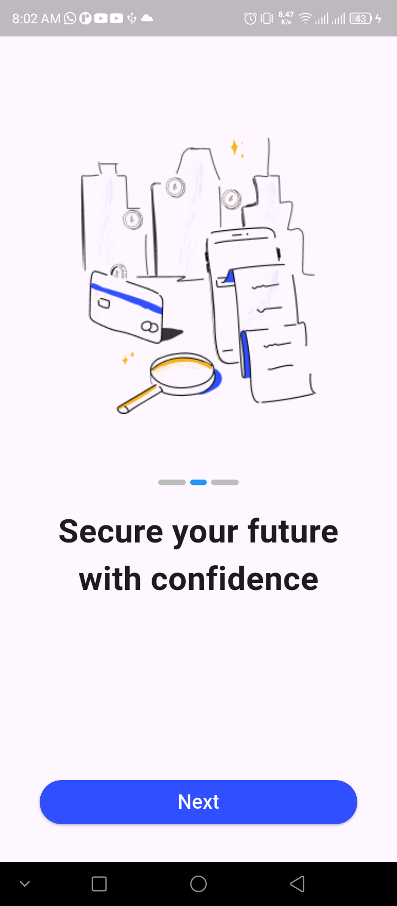

# coinpay_fintech_finance

## 📱 Screenshots

### Splash Screen


### Onboarding Screens

 
 


---

## 🛠️ Features

- ✅ Custom animated splash screen
- ✅ Three-step onboarding flow
- ✅ Page indicators and "Next" button
- ✅ Smooth navigation
- ✅ Clean and minimal UI

---

## 🔧 Getting Started

### 1. Clone the repo

```bash
git clone https://github.com/yourusername/coinpay_flutter.git
cd coinpay_flutter

A few resources to get you started if this is your first Flutter project:

- [Lab: Write your first Flutter app](https://docs.flutter.dev/get-started/codelab)
- [Cookbook: Useful Flutter samples](https://docs.flutter.dev/cookbook)

For help getting started with Flutter development, view the
[online documentation](https://docs.flutter.dev/), which offers tutorials,
samples, guidance on mobile development, and a full API reference.
